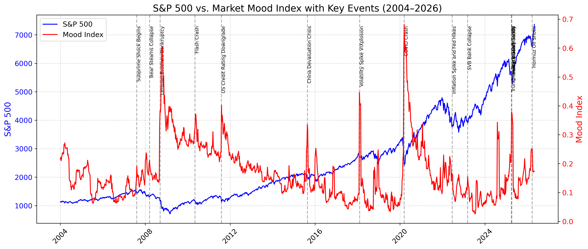
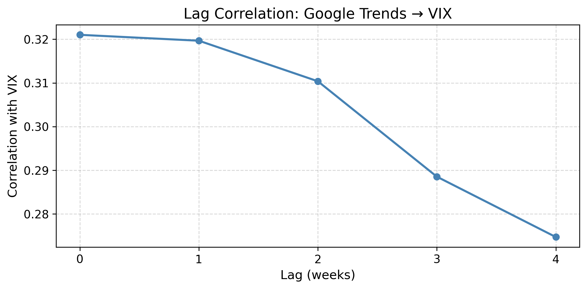
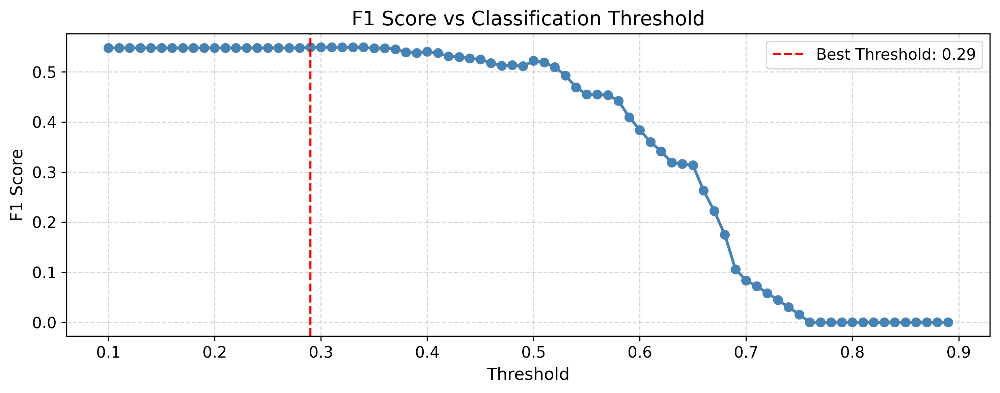
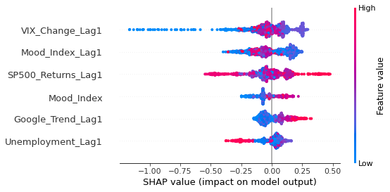

🧭 Market Mood Forecasting
Combining financial, sentiment, and macroeconomic indicators into an early-warning system for S&P 500 drops.
Built using Python, pandas, scikit-learn, XGBoost, and SHAP — structured in professional pull requests.

📌 Project Workflow
| PR | Branch | Description |
|----|--------|-------------|
| 0️⃣ | initial-structure | Repo setup, folders, `.gitignore`, README.md |
| 1️⃣ | feature/load-data | Load raw data: S&P 500, VIX, Google Trends, Unemployment |
| 2️⃣ | feature/clean-transform | Clean, resample, align, build Mood Index |
| 2️⃣.1 | hotfix/reproducibility | ✅ Save final `.csv` to stop repeated API pulls |
| 3️⃣ | feature/eda | Exploratory Data Analysis — historical trends, overlays, events |
| 4️⃣ | feature/feature-engineering | Lag correlations, Granger tests, rolling stats |
| 5️⃣ | feature/modeling | XGBoostClassifier + GridSearchCV, threshold tuning |
| 6️⃣ | feature/explainability | SHAP: beeswarm, summary bar, heatmap |
| 7️⃣ | feature/final-notebook | Final reproducible notebook — workflow + plots |
| 8️⃣ | feature/docs-assets | Final README.md, `Technical_Documentation.pdf`, `architecture.md` |
| 9️⃣ | feature/gradio-app | (Planned) Gradio prototype |
| 🔟 | deploy/huggingface-spaces | (Planned) Deploy to Hugging Face Spaces |

📊 Key Highlights
• ✅ Custom Mood Index (VIX + Google Trends + Unemployment)
• ✅ Weekly resampling with clear alignment to market cycles
• ✅ Robust hotfix to save cleaned .csv for reproducibility (no repeated API calls)
• ✅ GridSearchCV hyperparameter search + threshold tuning
• ✅ High recall for early warning signals
• ✅ SHAP visualizations for model transparency

## ⚙️ Final Model Evaluation

- **Best model**: XGBoostClassifier (216-tuned params)
- **Best threshold**: ~0.29 (not default 0.5!)
- **Metrics:**
  - Accuracy: ~38%
  - F1 Score: ~0.55 ✅
  - Recall (↓): 100% ✅
  - Precision (↓): ~38%
  - ROC AUC: ~0.49

✔️ Trade-off: Maximizes recall to flag risky periods — critical for financial risk context.

📂 Deliverables
• 07_final_notebook.ipynb — clear, organized, with saved plots
• data/cleaned_data.csv — versioned output to avoid multiple API calls
• /images/ — EDA, feature, modeling, explainability visuals
• models/xgb_market_mood.pkl — final trained XGBoost model
• README.md — updated workflow, highlights, and links
• Technical_Documentation.pdf — detailed data lineage, PR steps, visual appendix
• architecture.md — project pipeline diagram

🚀 Future Work
• Deploy an interactive Gradio prototype (app.py)
• Push app to Hugging Face Spaces for public testing
(Will be added in PR#9 and PR#10)

📈 Key Learnings
• ✅ Combining multiple fear/volatility signals improves market timing.
• ✅ Reproducibility hotfix: saving versioned datasets avoids repeated API calls and environmental mismatches.
• ✅ Threshold tuning & SHAP make the model more robust and explainable.

🗂️ See Also
• Full workflow, PRs, and detailed visuals in:
o Technical_Documentation.pdf
o architecture.md

🖼️ Example Visuals

Here are some sample visuals from the project.
*Full EDA, feature engineering, modeling, and SHAP explainability plots are available in `Technical_Documentation.pdf` and `/images/` folders.*

### 📈 EDA

### 🔬 Feature Engineering

### ⚙️ Modeling

### 🧩 Explainability

