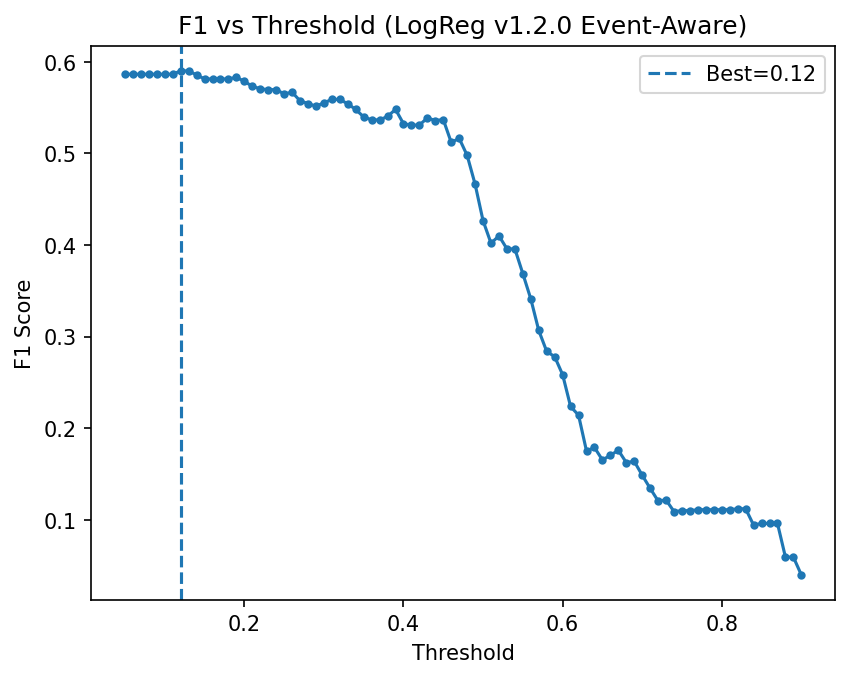
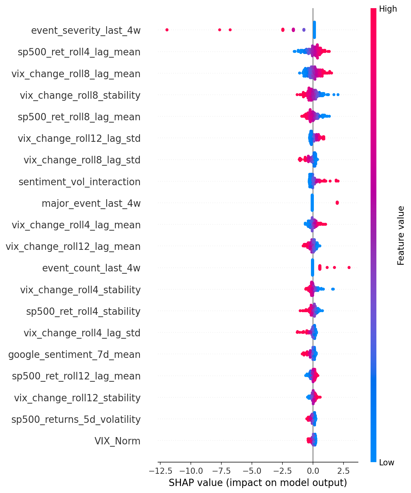
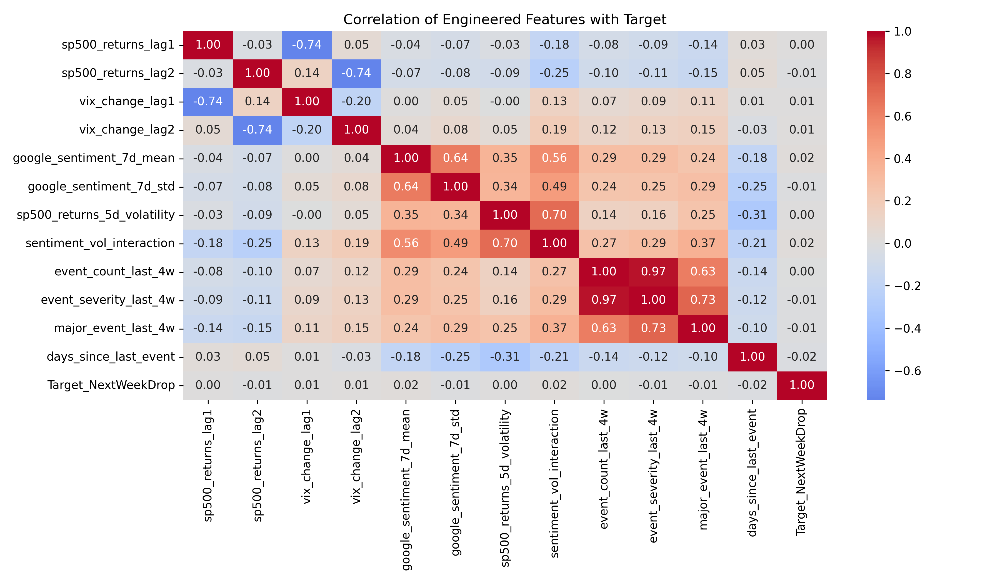

# Market Mood Forecasting

[](https://huggingface.co/spaces/Artur-Melnyk/Market-Mood-Forecasting)
[](#)
[](LICENSE)

Leakage-safe, event-aware market forecasting project that predicts whether the S&P 500 is likely to experience a downside movement during the following week.

The project combines:

* macroeconomic indicators
* Google sentiment data
* VIX volatility behavior
* engineered rolling market features
* event-risk contextual signals
* walk-forward validation
* interpretable Logistic Regression modeling
* bilingual Gradio deployment

Version v1.2.0 introduces:

* refreshed 2026-aligned market data
* leakage-safe event-risk features
* walk-forward validation framework
* contextual macro-event modeling
* refreshed explainability outputs
* bilingual EN/DE Gradio interface
* deployment UX/UI polish
* updated deployment artifacts

---

# Live Demo

Hugging Face Space:

https://huggingface.co/spaces/Artur-Melnyk/Market-Mood-Forecasting

The deployed Gradio application includes:

* bilingual English/German UI
* interactive probability forecasting
* leakage-safe prediction pipeline
* diagnostics panel
* explainability guidance
* lightweight deployment architecture

---

# Project Goal

The goal of the project is to estimate the probability that the market will experience a meaningful decline during the following week.

The target variable is:

```text
Target_NextWeekDrop = 1
```

if the following week's S&P 500 return is negative enough to qualify as a downside event.

The project is intentionally designed as:

* a time-aware classification system
* leakage-safe financial ML workflow
* interpretable forecasting pipeline
* reproducible end-to-end portfolio project
* lightweight deployable market-risk application

---

# Dataset Scope

The refreshed v1.2.0 dataset uses weekly observations spanning approximately:

```text
2004 — May 2026
```

The pipeline combines four major signal domains:

* S&P 500 market behavior
* VIX volatility structure
* Google sentiment / Google Trends signals
* macroeconomic indicators such as unemployment

Version v1.2.0 additionally introduces:

* contextual historical event-risk engineering
* geopolitical and tariff-event aggregation
* event recency and severity windows
* macro-event category indicators

After cleaning and feature engineering, the final dataset contains approximately:

* ~950 weekly observations
* ~40+ engineered leakage-safe features

---

# v1.2.0 Key Improvements

Compared with v1.1.2, the refreshed pipeline adds:

| Improvement                 | Description                                                               |
| --------------------------- | ------------------------------------------------------------------------- |
| Event-risk features         | Historical event context transformed into leakage-safe aggregate features |
| Walk-forward validation     | Expanding-window time-aware evaluation                                    |
| 2026 refresh                | Updated macro, market, and volatility coverage                            |
| Macro-event engineering     | Tariff, geopolitical, banking, volatility, and policy event categories    |
| Improved explainability     | Event-aware SHAP and dependence plots                                     |
| Bilingual deployment        | English/German Gradio interface                                           |
| Deployment polish           | Improved UX/UI and diagnostics layer                                      |
| Cleaner artifact management | Consolidated v1.2.0 outputs and deployment alignment                      |

---

# Final v1.2.0 Results

| Metric / Item       |                                        Value |
| ------------------- | -------------------------------------------: |
| ROC AUC             |                                        ~0.53 |
| PR AUC              |                                        ~0.44 |
| Best F1 Score       |                                        ~0.58 |
| Best Threshold      |                                        ~0.25 |
| Final Model         |                          Logistic Regression |
| Validation Strategy |                      Walk-forward validation |
| Explainability      | SHAP + coefficients + permutation importance |
| Forecasting Style   |               Conservative risk-alert system |

---

# Modeling Interpretation

The refreshed v1.2.0 pipeline should be interpreted as:

* an event-aware market-risk forecasting system
* a contextual downside-alert model
* an interpretable macro-event forecasting workflow

rather than a precision-focused trading engine.

Event-risk features improved contextual awareness and slightly improved F1-oriented behavior, while ranking-quality metrics such as PR AUC remained relatively stable.

This outcome remains valuable because the project demonstrates:

* leakage-safe event engineering
* walk-forward validation
* macro-event contextualization
* interpretable financial ML workflow design
* reproducible experiment comparison methodology

---

# Event-Risk Feature Engineering

Version v1.2.0 introduces leakage-safe event-risk features derived from historical market events.

The model does NOT receive raw event names such as:

* COVID Crash
* Lehman Brothers Bankruptcy
* Trump Black Monday

Instead, the pipeline converts historical events into aggregate contextual features such as:

* event count in recent windows
* severity-weighted event density
* days since the latest known event
* broad event-category indicators

Examples include:

```text
event_count_last_4w
event_severity_last_8w
major_event_last_4w
days_since_last_event
tariff_trade_event_last_4w
geopolitical_event_last_8w
```

This design preserves contextual signal while preventing future leakage.

---

# Walk-Forward Validation

Version v1.2.0 replaces the earlier single holdout strategy with expanding-window walk-forward validation.

The process:

1. trains on earlier historical windows
2. validates on future unseen periods
3. repeats chronologically across folds

This better reflects realistic financial forecasting conditions.

Saved validation artifacts include:

```text
walk_forward_summary_v1_2_0.csv
walk_forward_folds_v1_2_0.csv
tscv_auc_summary_v1_2_0.csv
```

---

# Selected Visuals

## Threshold Selection



## SHAP Summary



## Feature Correlation Heatmap



---

# Interactive App

The Gradio deployment includes:

* bilingual EN/DE interface
* lightweight deployment architecture
* interactive market-risk prediction
* diagnostics and metadata panel
* explainability guidance
* hidden feature reconstruction
* leakage-safe probability forecasting

The application intentionally remains lightweight and portfolio-focused rather than enterprise-scale.

Large technical visuals and extended artifacts remain in the GitHub repository rather than inside the deployed Space.

---

# Repository Structure

```text
Market-Mood-Forecasting/
│
├── data/
├── docs/
├── images/
├── models/
├── notebooks/
├── utils/
│
├── app.py
├── requirements.txt
├── runtime.txt
├── README.md
└── LICENSE
```

---

# Notebook Workflow

## 01_load_data.ipynb

Loads and refreshes:

* S&P 500 data
* VIX data
* unemployment data
* Google sentiment signals

---

## 02_clean_data.ipynb

Performs:

* weekly alignment
* missing-value handling
* frequency standardization
* temporal synchronization

---

## 03_exploratory_analysis.ipynb

Explores:

* volatility trends
* sentiment behavior
* market-event annotation overlays
* historical downside periods
* correlation structure

---

## 04_feature_engineering.ipynb

Builds leakage-safe features including:

* lagged returns
* rolling volatility
* stability measures
* sentiment interactions
* event-risk aggregation
* event recency windows

---

## 05_modeling.ipynb

Implements:

* walk-forward validation
* baseline vs event-aware comparison
* threshold optimization
* Logistic Regression training
* leakage safety checks

Final artifact:

```text
logreg_pipeline_v1_2_0_*.joblib
```

---

## 06_model_explain.ipynb

Generates:

* SHAP summary plots
* permutation importance
* coefficient importance
* event-aware dependence plots

---

## 07_final_notebook.ipynb

Creates:

* consolidated reviewer notebook
* final project summary
* production feature overview
* modeling interpretation
* final conclusions

---

# Local Run

Run locally:

```bash
python app.py
```

---

# Additional Documentation

The repository also includes:

* technical documentation
* architecture overview
* model card
* testing instructions
* project presentation

---

# Disclaimer

This project is for educational and portfolio purposes only.

It is not financial advice or investment advice.

The project is intended to demonstrate:

* leakage-safe financial ML
* walk-forward validation
* event-aware feature engineering
* explainable modeling
* reproducible deployment workflow

---

# Future Improvements

Potential future enhancements:

* scenario simulation mode
* probabilistic calibration
* richer macroeconomic indicators
* lightweight gradient boosting comparison
* advanced event scenario testing
* enhanced mobile responsiveness
* additional deployment UX refinements

---

# Author

Created by Artur Melnyk as a portfolio project demonstrating:

* end-to-end data science workflow
* time-series forecasting
* event-aware feature engineering
* leakage-safe modeling
* walk-forward validation
* explainable AI
* lightweight Gradio deployment
* bilingual deployment design
