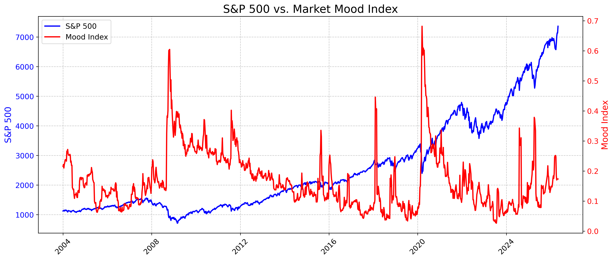
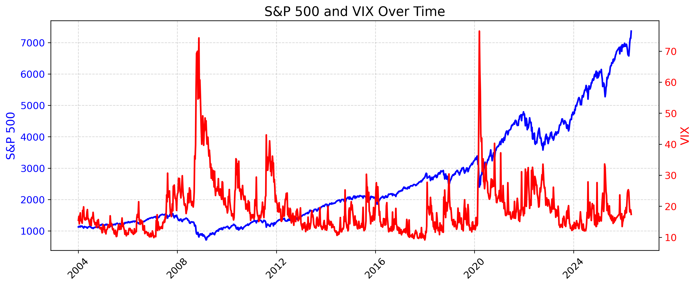
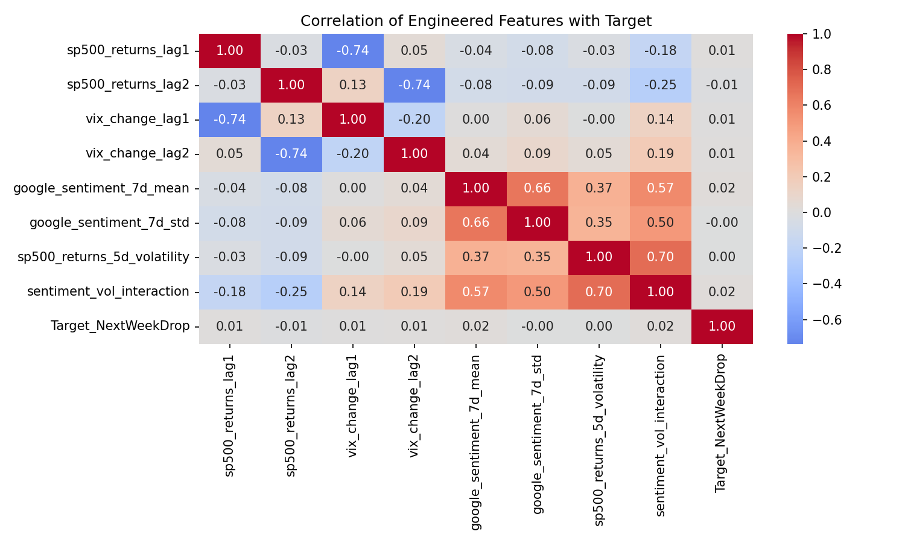
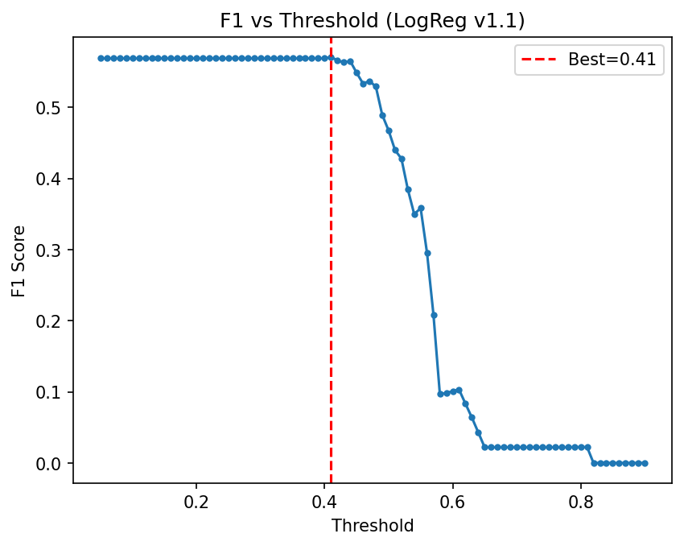
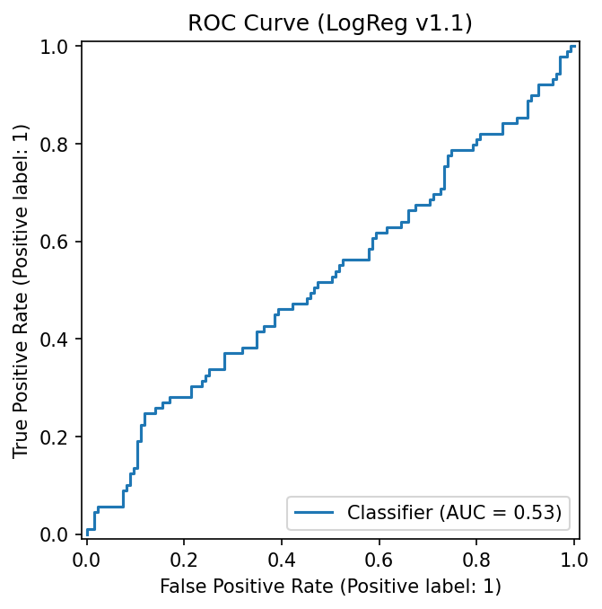
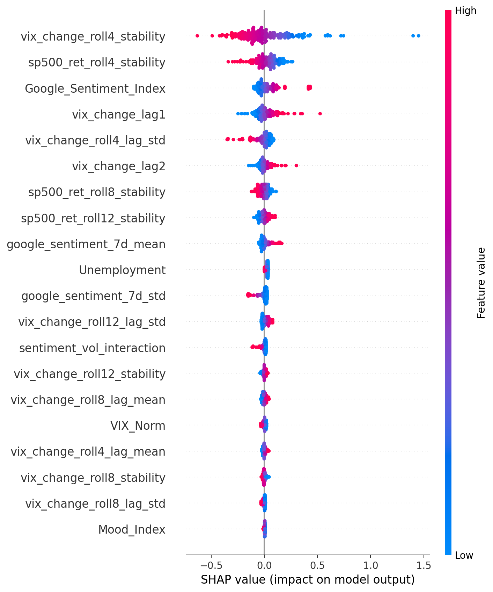
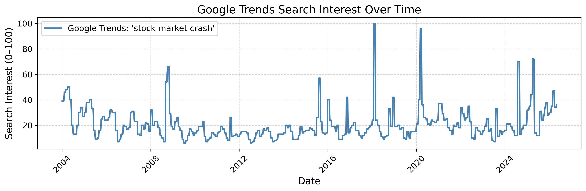

# Market Mood Forecasting — Technical Documentation (Hotfix v1.1)

## 1. Project Overview

**Project name:** Market Mood Forecasting
**Version:** Hotfix v1.1
**Primary objective:** Build a leakage-safe, interpretable classification pipeline that estimates the probability of a next-week market drop using market, volatility, sentiment, and macroeconomic features.

This project was rebuilt in v1.1 to remove information leakage, simplify the final modeling layer, refresh explainability outputs, and align the Gradio app with the final saved artifact.

This document is intended to live in `docs/`, so all image paths below use relative paths such as `../images/...`.

### Dataset Scope

The final v1.1 modeling dataset uses weekly observations from approximately 2004–2025.

After cleaning, feature engineering, lag creation, rolling-window construction, and removal of rows without sufficient historical context, the final model-ready dataset contains approximately 950 weekly observations and 32 leakage-safe engineered features.

The features are derived from four main domains:

* S&P 500 market behavior
* VIX volatility behavior
* Google sentiment / Google Trends indicators
* macroeconomic context, including unemployment

---

## 2. Hotfix v1.1 Context

The earlier version of the project required a correction because some variables and design choices created leakage risk.

Before the v1.1 rebuild, initial validation results appeared unrealistically strong for a noisy weekly financial forecasting problem, with pre-hotfix ROC AUC around 0.65. This was treated as a warning sign rather than a success.

The suspiciously strong result triggered a leakage investigation focused on:

* target-adjacent columns
* future-like feature names
* next-week derived variables
* feature timing
* whether the model could indirectly access information from the prediction horizon

The final v1.1 rebuild intentionally accepts lower but more credible performance after leakage removal.

Hotfix v1.1 introduced the following changes:

* leakage-causing variables were removed from the final modeling matrix
* the final pipeline was rebuilt around a Logistic Regression baseline
* notebooks `05_modeling.ipynb`, `06_model_explain.ipynb`, and `07_final_notebook.ipynb` were rerun
* final artifacts were regenerated
* the app was updated to load the rebuilt final artifact pair and enforce guardrails
* repository tracking was cleaned so only the intended final artifacts remain

The final result is a more trustworthy and reproducible project, even though the predictive performance is modest.

---

## 3. Repository Structure

The structure below reflects the project itself, not ignored local folders such as `.venv/`, `__pycache__/`, or `.ipynb_checkpoints/`.

```text
Market-Mood-Forecasting/
│
├── data/
│   ├── raw/
│   ├── cleaned/
│   └── feature_engineered/
│
├── docs/
│   ├── architecture.md
│   ├── technical_documentation.md
│   ├── model_card.md
│   ├── testing_instructions.md
│   └── presentation.pdf
│
├── images/
│   ├── eda/
│   ├── feature_engineering/
│   ├── modeling/
│   └── model_explain/
│
├── models/
│   ├── logreg_pipeline_v1_1_1775664292.joblib
│   ├── logreg_pipeline_v1_1_1775664292.json
│   ├── logreg_coeff_importance_v1_1.csv
│   ├── model_compare_v1_1.csv
│   ├── permutation_importance_v1_1.csv
│   ├── shap_importance_v1_1.csv
│   ├── shap_top10_v1_1.csv
│   ├── tscv_auc_folds_v1_1.csv
│   └── tscv_auc_summary_v1_1.csv
│
├── notebooks/
│   ├── 01_load_data.ipynb
│   ├── 02_clean_data.ipynb
│   ├── 03_exploratory_analysis.ipynb
│   ├── 04_feature_engineering.ipynb
│   ├── 05_modeling.ipynb
│   ├── 06_model_explain.ipynb
│   └── 07_final_notebook.ipynb
│
├── utils/
├── app.py
├── .env.example
├── .gitignore
├── LICENSE
├── README.md
├── requirements.txt
└── runtime.txt
```

Notes:

* ignored local execution folders are intentionally omitted from the documented structure
* `technical_documentation.md`, `model_card.md`, `testing_instructions.md`, and `presentation.pdf` are the intended final documentation set for this repository

---

## 4. End-to-End Workflow

The project follows a seven-stage workflow:

1. Load the source market and macroeconomic data
2. Clean and align the raw inputs
3. Explore sentiment, volatility, and market behavior
4. Build leakage-safe engineered features
5. Train and evaluate the final classification model
6. Explain the final model with SHAP and importance analysis
7. Serve the final artifact through a Gradio app

---

## 5. Notebook 01 — Data Loading

**File:** `notebooks/01_load_data.ipynb`

Purpose:

* load the original source files
* inspect schema, date range, and basic completeness
* standardize initial loading so downstream notebooks use a consistent base

Typical variables used throughout the project include:

* market price information
* volatility information
* sentiment information
* macroeconomic indicators

Key outputs:

* initial loaded dataset
* date normalization foundation for later steps

This notebook is preparatory and does not create the final artifact.

---

## 6. Notebook 02 — Data Cleaning

**File:** `notebooks/02_clean_data.ipynb`

Purpose:

* convert columns to proper data types
* clean invalid rows and duplicates
* align time-based records
* ensure numeric consistency before feature engineering

Typical operations:

* datetime conversion
* sorting by date
* missing value handling
* safe type coercion

Output:

* cleaned dataset prepared for exploratory analysis and feature engineering

This step does not introduce future information.

---

## 7. Notebook 03 — Exploratory Analysis

**File:** `notebooks/03_exploratory_analysis.ipynb`

Purpose:

* explore relationships between market returns, sentiment, and volatility
* inspect target behavior and market context before modeling
* create reviewer-friendly EDA visuals

Saved EDA images include:

```text
../images/eda/google_trends_sentiment.png
../images/eda/mood_vs_sp500.png
../images/eda/mood_vs_sp500_annotated.png
../images/eda/sp500_vs_vix.png
```

Representative markdown examples from inside `docs/`:

```markdown


```

This stage is descriptive and diagnostic. It is not the source of the final model artifact.

---

## 8. Notebook 04 — Feature Engineering

**File:** `notebooks/04_feature_engineering.ipynb`

This notebook is the foundation of the v1.1 hotfix.

Purpose:

* create leakage-safe engineered predictors using only historical information
* remove unsafe target-adjacent or future-looking feature definitions
* prepare the final feature matrix used by modeling

The final v1.1 model matrix contains 32 leakage-safe engineered features after feature filtering and alignment.

### 8.1 Feature Design Principles

Only past information is allowed.

Examples of engineered features used in the final workflow include:

* `sp500_returns_lag1`
* `sp500_returns_lag2`
* `vix_change_lag1`
* `vix_change_lag2`
* `google_sentiment_7d_mean`
* `google_sentiment_7d_std`
* `sp500_returns_5d_volatility`
* `sentiment_vol_interaction`
* rolling stability and lag-statistic features used later in modeling

### 8.2 Leakage Guardrails

The following are excluded from the final model layer:

* `Target_NextWeekDrop`
* `Mood_Zone`
* `Mood_Zone_Cat`
* future-looking features
* lead features
* target-derived categorization
* raw columns that would leak contemporaneous or future information into prediction

### 8.3 Feature Diagnostic Output

The notebook saves a correlation heatmap that belongs to feature engineering, not to the final modeling or explainability stage:

```text
../images/feature_engineering/feature_corr_heatmap_v1_1.png
```

Rendered output:



Primary output dataset:

```text
data/feature_engineered/fe_dataset_v1_1.csv
```

---

## 9. Notebook 05 — Modeling

**File:** `notebooks/05_modeling.ipynb`

Purpose:

* train the final leakage-safe classifier
* evaluate performance on a time-ordered split
* export the final model pipeline and metadata

### 9.1 Final Model Choice

The final v1.1 model is **Logistic Regression**.

Alternative models, including **Random Forest** and **XGBoost**, were evaluated during modeling. They were useful as comparison checks, but they did not provide stable improvement under time-aware validation.

Logistic Regression was selected because it provided the strongest balance of:

* interpretability
* robustness after leakage removal
* simpler debugging
* easier deployment
* clearer explanation for portfolio and reviewer purposes

This choice also aligns with the project philosophy:

```text
trustworthy baseline > fragile complexity
```

### 9.2 Pipeline Design

The final pipeline is a scikit-learn pipeline with preprocessing and classification stages.

High-level structure:

```text
Imputation -> Scaling -> Logistic Regression
```

The notebook also performs comparative checks against alternative models for sanity, but Logistic Regression is the selected final artifact.

### 9.3 Data Split Strategy

The validation setup is chronological, not randomly shuffled.

This is critical because the project is time-aware and the goal is to avoid contamination from future observations.

Current validation uses a chronological holdout split. This is leakage-safe and appropriate for a portfolio baseline, but it is still only a single time-based split.

A future improvement is rolling / walk-forward time-series cross-validation. This would test whether the model remains stable across multiple historical windows instead of relying on one train-validation boundary.

### 9.4 Final Threshold Selection

The earlier documentation draft mistakenly stated a different threshold.

The correct best threshold for the final v1.1 run is approximately:

```text
0.41
```

This is supported by the saved threshold plot and aligns with the final modeling outputs.

### 9.5 Saved Modeling Figures

The final modeling notebook produces the following saved images:

```text
../images/modeling/f1_vs_threshold_v1_1.png
../images/modeling/logreg_coeff_importance_v1_1.png
../images/modeling/permutation_importance_v1_1.png
../images/modeling/pr_curve_v1_1.png
../images/modeling/roc_curve_v1_1.png
```

Rendered outputs:





### 9.6 Saved Model Artifact

Final artifact pair:

```text
models/logreg_pipeline_v1_1_1775664292.joblib
models/logreg_pipeline_v1_1_1775664292.json
```

The JSON stores deployment metadata such as:

* feature order
* visible features exposed in the app
* training medians
* artifact name
* model metadata required by the interface

---

## 10. Notebook 06 — Model Explainability

**File:** `notebooks/06_model_explain.ipynb`

Purpose:

* explain the final Logistic Regression model
* confirm the final model behavior is interpretable and coherent
* generate reviewer-friendly explanation visuals

Explainability methods used:

* coefficient magnitude review
* permutation importance
* SHAP LinearExplainer
* SHAP dependence plots

Saved outputs in `images/model_explain/`:

```text
../images/model_explain/dependence_Google_Sentiment_Index_v1_1.png
../images/model_explain/dependence_sp500_ret_roll4_stability_v1_1.png
../images/model_explain/dependence_vix_change_lag1_v1_1.png
../images/model_explain/dependence_vix_change_roll4_lag_std_v1_1.png
../images/model_explain/dependence_vix_change_roll4_stability_v1_1.png
../images/model_explain/shap_top20_bar_v1_1.png
../images/model_explain/summary_v1_1.png
```

Rendered output:



Important interpretation note:

* several dependence plots are highly linear because the final model is Logistic Regression and the explainability method is consistent with a linear model
* this is expected and not a sign of artifact corruption

---

## 11. Notebook 07 — Final Notebook

**File:** `notebooks/07_final_notebook.ipynb`

Purpose:

* present the final project state in one reviewer-friendly notebook
* consolidate outputs from notebooks 05 and 06
* provide a polished final narrative for portfolio review

The final notebook includes:

* project summary
* environment snapshot
* artifact references
* modeling outputs
* explainability outputs
* final conclusions

This notebook is not the source of the main artifact; it is the presentation-ready consolidation layer.

---

## 12. Final Metrics Summary

Based on the final v1.1 rerun, the key reported metrics are approximately:

* **ROC AUC:** 0.53
* **Average Precision / PR AUC:** 0.45
* **Best F1:** 0.57
* **Best threshold:** 0.41

The positive class is moderately imbalanced, with the drop class representing roughly 40% of observations. Because of this, Average Precision / PR AUC and F1-based threshold selection are more informative than accuracy alone.

The final threshold of approximately 0.41 should be interpreted as a risk-alert boundary, not as a trading trigger.

Interpretation:

* performance is modest
* the important success of v1.1 is credibility and leakage safety, not inflated accuracy
* the final model is intentionally conservative and interpretable

---

## 13. Application Layer (`app.py`)

The project includes a Gradio app implemented in `app.py`.

### 13.1 What the App Loads

The app loads the final saved artifact and metadata from `models/`. It is currently configured to use:

```text
models/logreg_pipeline_v1_1_1775664292.joblib
models/logreg_pipeline_v1_1_1775664292.json
```

The app loads the JSON metadata first and enforces feature and guardrail checks before serving predictions.

### 13.2 Visible User Inputs

The interface exposes a small set of interpretable visible features:

- `vix_change_roll4_stability`
- `sp500_ret_roll4_stability`
- `Google_Sentiment_Index`
- `vix_change_lag1`
- `vix_change_lag2`
- `google_sentiment_7d_mean`
- `Unemployment`
- `Mood_Index`

All other required features are filled using stored training medians.

### 13.3 Built-In Guardrails

The app blocks forbidden features such as:

- `Target_NextWeekDrop`
- `Mood_Zone`
- `Mood_Zone_Cat`
- future / lead-like naming patterns

This is implemented directly in the app logic as an extra protection layer on top of the notebook workflow.

### 13.4 App Behavior

The app contains three tabs:

- Predict
- Explain & Docs
- Diagnostics

Special behavior includes:

- all-zero visible input is intentionally treated as invalid and returns “No prediction generated”
- the app can generate a demo nudge off baseline
- local contribution plots are shown for non-baseline scenarios

### 13.5 Local Launch

The final local launch configuration uses:

server_name="127.0.0.1"  
server_port=7860

Therefore, the app launches locally at:

http://127.0.0.1:7860

---

## 14. Relative Paths for Images from `docs/`

Since this documentation file lives in `docs/`, every image reference must step one directory upward.

Correct pattern:

```markdown
../images/<subfolder>/<file>.png
```

Examples:

```markdown



```

---

## 15. Reproducibility

Recommended execution order:

1. `01_load_data.ipynb`
2. `02_clean_data.ipynb`
3. `03_exploratory_analysis.ipynb`
4. `04_feature_engineering.ipynb`
5. `05_modeling.ipynb`
6. `06_model_explain.ipynb`
7. `07_final_notebook.ipynb`

Install dependencies:

```bash
pip install -r requirements.txt
```

Run the app:

```bash
python app.py
```

Open locally:

```text
http://127.0.0.1:7860
```

---

## 16. Limitations

* this is a portfolio and educational project
* it is not financial advice and not a trading recommendation
* predictive performance is intentionally modest after leakage removal
* the main strength of v1.1 is methodological integrity, not aggressive predictive claims
* Logistic Regression was chosen for interpretability and stability rather than maximum complexity

---

## 17. Future Improvements

Reasonable next steps for this project:

* evaluate stronger time-series validation strategies
* compare additional leakage-safe baselines under the same rules
* add probability calibration
* improve deployment packaging for Hugging Face Spaces
* continue documentation refinement with `architecture.md`, `model_card.md`, and `testing_instructions.md`


